# Cloud Computing Lab – Lab 1 

**Name:** Rughma Malik  
**Reg No:** 2023-BSE-54  
**Course:** Cloud Computing Lab  
**Section:** V-B  

**LAB-1**

## VMware Installation

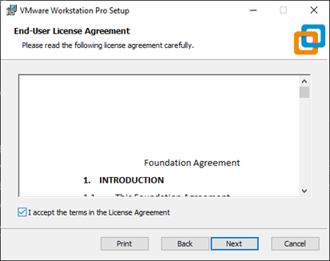
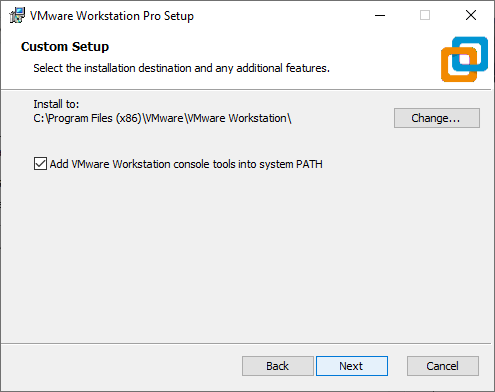
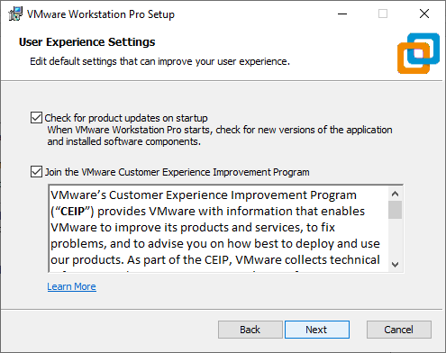
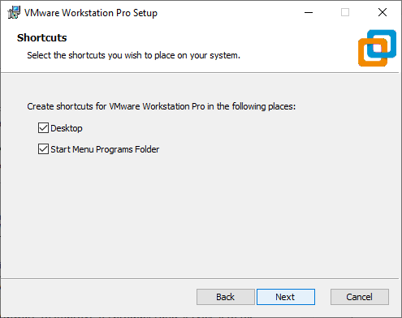
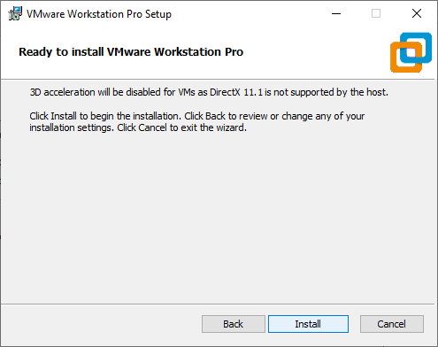

## Ubuntu Server Installation
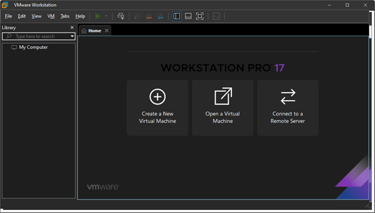
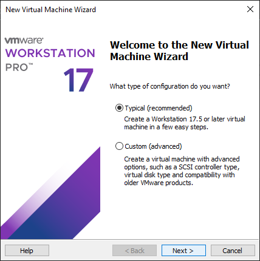
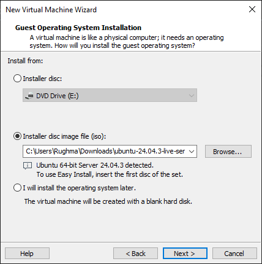
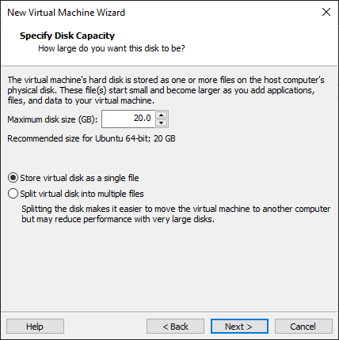

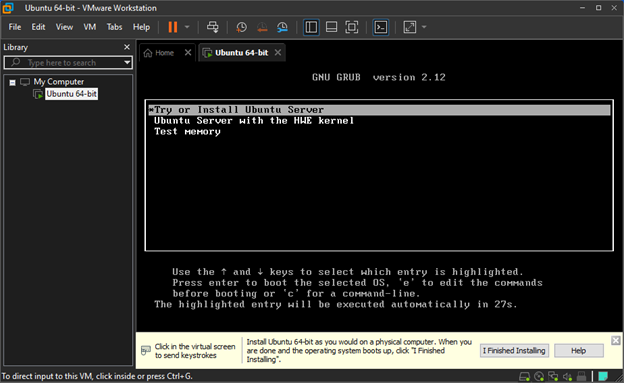
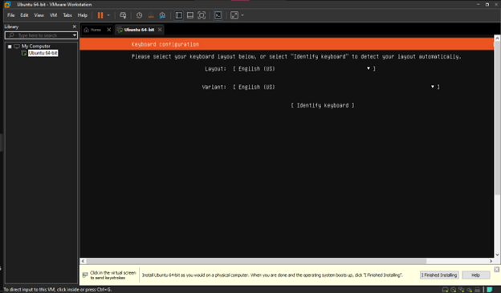
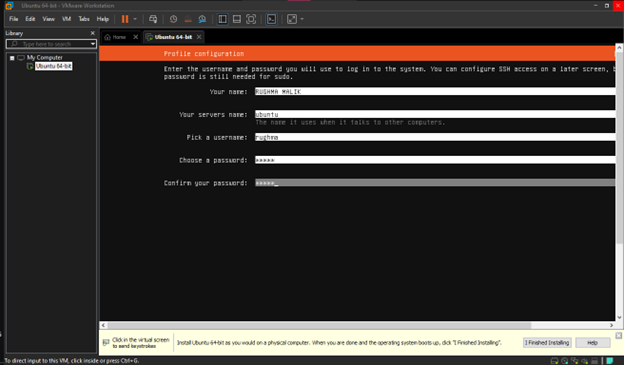
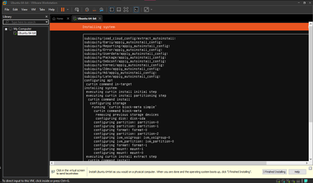
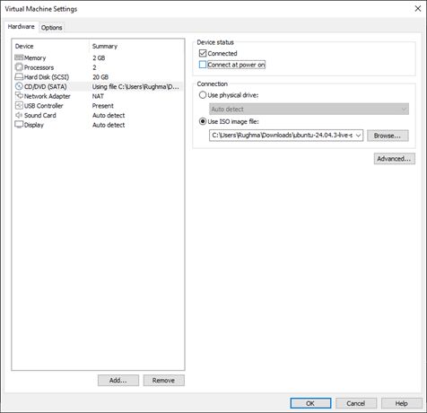
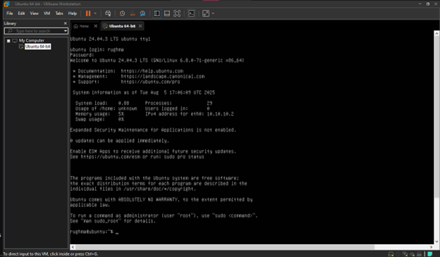

## Accessing Ubuntu Server from Windows
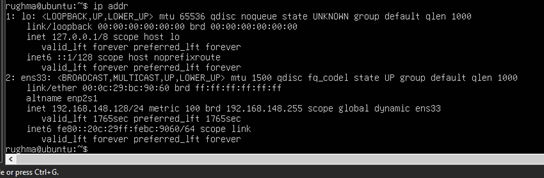
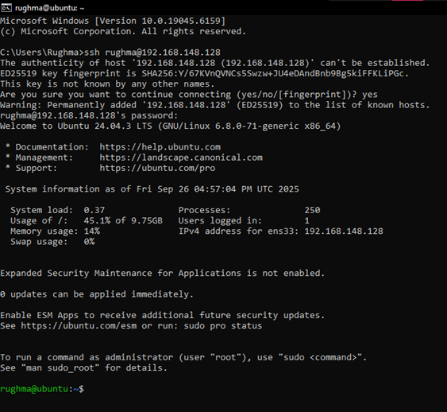

